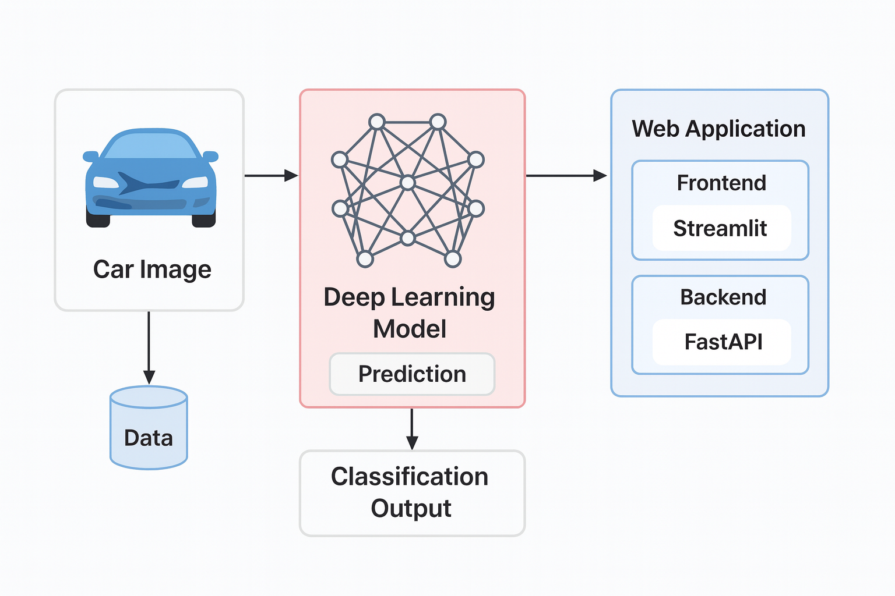

# Vehicle Damange Detection App

This project is an end-to-end car damage image classification system built using deep learning and deployed with FastAPI and Streamlit.  
Users can drag and drop a car image (front or rear third-quarter view), and the system predicts the type of damage using a ResNet50 transfer learning model.  
The project focuses on handling limited data through regularization, transfer learning, and building a complete ML pipeline from training to deployment.


## 🎯 Features

- Classifies car images into 6 damage categories.

- Handles both front and rear vehicle views.

- Uses transfer learning (ResNet50) for improved performance.

- Hyperparameter tuning using Optuna.

- FastAPI backend for model inference.

- Streamlit frontend for user interaction.

- Lightweight and easy to run locally.

## Project Structure
- **Streamlit-app** – Contains the Streamlit application code and UI components for car damage classification.

- **Fastapi-server** – Contains the FastAPI backend responsible for loading the trained model and handling inference requests.

- **model** – Stores the trained deep learning models (CNN, EfficientNet, ResNet50) saved after training and hyperparameter tuning.

- **training** – Contains the dataset organized by damage categories (front and rear views), Jupyter notebooks used for data preprocessing, model training, experimentation, and evaluation. 

- **requirements.txt** – Lists all required Python packages to run the project.

- **README.md** – Provides an overview, methodology, setup instructions, and project details.


## 🧠 Methodology

1️) Data Preparation

- Dataset size: ~2300 images

- Classes:

     - Front Normal
     - Front Crushed
     - Front Breakage
     - Rear Normal
     - Rear Crushed
     - Rear Breakage
  
- Images resized and normalized

- Data split into training and validation sets

2️) Model Experiments

-  Custom CNN (Baseline)

   - Initial CNN model trained from scratch

   - Regularization techniques applied:

     - Batch Normalization
     - Dropout
     - L2 regularization (weight_decay = 1e-4)
   - Result: Limited accuracy due to small dataset

- EfficientNet-B0 (Transfer Learning)

  - Pretrained EfficientNet-B0 used

  - Fully connected layer replaced

  - Backbone layers frozen

  - Result: Slight improvement over CNN

- ResNet50 (Final Model)

  - Pretrained ResNet50 used

  - Classification head modified for 6 classes

  - Backbone layers frozen

  - Best performing model with ~79.65% validation accuracy

3️) Hyperparameter Optimization

- Optuna used for tuning:

  - Learning rate

  - Dropout rate

  - Optimizer selection

  - Batch size

- Improved stability and generalization

4️) Deployment

- Trained model saved and loaded for inference

- Backend created using FastAPI

- Frontend built using Streamlit

- End-to-end prediction pipeline implemented

## 📌 Project Architecture


## Demo video
https://drive.google.com/file/d/1lVU3adccuvMw3I5RqQ1fZQ-UdOzwhdTs/view?usp=sharing


## How to Use
1. Start the backend server with FastAPI.
2. Run the frontend with Streamlit.
3. Open browser and go to: http://localhost:8501.
4. Upload a Car Image:
   - Upload a front or rear view image.
   - The app will display the predicted damage class.

## 🛠️ Tech Stack

- Programming Language: Python

- Deep Learning: PyTorch

- Models: CNN, EfficientNet-B0, ResNet50

- Hyperparameter Tuning: Optuna

- Backend: FastAPI

- Frontend: Streamlit

- Image Processing: Pillow


## Setup Instructions

1. **Clone the repository**:
   ```bash
   git clone https://github.com/HarshithaV2002/deep-learning-project-damage-prediction.git
   cd deep-learning-project-damage-prediction
   ```

1. **Install dependencies:**:   
   ```commandline
    pip install -r requirements.txt
   ```
1. **Run the FastAPI server:**:   
   ```commandline
    uvicorn server.server:app --reload
   ```
1. **Run the Streamlit app:**:   
   ```commandline
    streamlit run app.py

   ```

## 🧾 Conclusion

This project demonstrates how transfer learning and regularization techniques can be effectively applied when working with limited image datasets. A baseline CNN model was first developed, followed by the use of a ResNet50 transfer learning model to improve performance. Hyperparameter tuning was applied to further enhance model stability and accuracy. The final model was deployed as a complete end-to-end application using FastAPI for backend inference and Streamlit for the frontend. Overall, the project reflects practical experience in building, optimizing, and deploying deep learning models in real-world scenarios.

